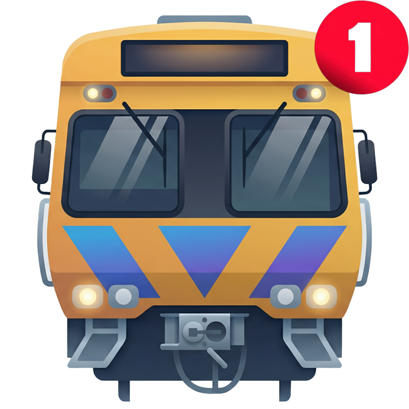

# YarraTrak

<p align="center">
  
</p>

**Real-time Melbourne public transport departures on your Pebble smartwatch.**

YarraTrak shows live train, tram, and V/Line departure times directly on your wrist. Configure your favourite stations and get instant, glanceable info — with vibration patterns that encode the wait time, so you know when to leave without looking at the screen.

## Features

- **Live departures** — real-time data from the PTV API with second-by-second countdown
- **Station watching** — tap a favourite to open a full-screen countdown timer with platform info
- **Smart vibrations** — haptic patterns encode minutes until departure (hours/tens/ones)
- **Vehicle tracking** — see how far your train is from the station (metro trains)
- **Multiple transport types** — metro trains, V/Line, and trams
- **Up to 10 favourites** — configure your daily commute stations
- **AI assistant** (optional) — ask natural language questions via Claude ("next train from Richmond to the city")

## Quick Start

### For Users (Rebble Appstore)

1. Install YarraTrak from the Rebble Appstore
2. The app comes pre-loaded with 4 demo entries — open it and you'll see live departures immediately
3. Open Settings on your phone to customise your favourite stations
4. (Optional) Add an Anthropic API key in Settings to enable the voice/text AI assistant

### For Self-Hosters

#### Server Setup

```bash
cd server
cp ../.env.example ../.env
# Edit .env with your PTV API credentials
pip install -r requirements.txt
uvicorn server.api:app --host 0.0.0.0 --port 8000
```

#### Environment Variables

| Variable | Required | Description |
|---|---|---|
| `PTV_DEV_ID` | Yes | PTV Timetable API developer ID |
| `PTV_API_KEY` | Yes | PTV Timetable API key |
| `PUBLIC_BASE_HOST` | No | Public Pebble/browser hostname. Default: `ptv.netcavy.net` |
| `INTERNAL_DASHBOARD_HOST` | No | Internal-only dashboard hostname. Default: `ptv.yourinternal.website` |
| `PUBLIC_APPSTORE_URL` | No | Redirect target for `GET /` on the public host. Default: `https://apps.repebble.com/` |
| `METRICS_LOG_INTERVAL_SECONDS` | No | Metrics normalization/capture interval. Default: `60` |
| `METRICS_HISTORY_INTERVAL_SECONDS` | No | Dashboard history sampling interval. Default: `60` |
| `METRICS_HISTORY_MAX_POINTS` | No | Retained in-memory history points. Default: `10080` (7 days at 60s sampling) |

Register for PTV API credentials at [ptv.vic.gov.au](https://www.ptv.vic.gov.au/footer/data-and-reporting/datasets/ptv-timetable-api/).

#### Building the Pebble App

```bash
cd pebble
pebble build
pebble install --phone YOUR_PHONE_IP
```

## Architecture

```
pebble/          Pebble.js smartwatch app
  src/js/app.js  Main app logic (WebSocket client, vibrations, UI)
  config/        Settings page (served by server)
server/          FastAPI Python server
  api.py         REST + WebSocket endpoints
  agent_engine.py  AI agent (Anthropic Claude)
  tools.py       Agent tool implementations
  ptv_client.py  PTV Timetable API client
  *.json         Pre-built station databases
```

### API Endpoints

| Endpoint | Auth | Description |
|---|---|---|
| `GET /api/v1/stations` | Open | Station database (train/tram/vline) |
| `POST /api/v1/favourite` | Open | Quick departure check |
| `POST /api/v1/query` | BYOK | AI agent text query |
| `WS /ws` | Open | Real-time departures + agent queries |
| `GET /internal/metrics` | Internal host only | Latest normalized dashboard snapshot |
| `GET /internal/metrics/history` | Internal host only | Rolling in-memory time series |

**BYOK** = Bring Your Own Key. Pass `llm_api_key` in the `POST /api/v1/query` body or in each WebSocket `query` message.

The server collects anonymous metrics about query and request volumes so performance and scalability can be monitored over time.

### Internal Dashboard Split

- `ptv.yourinternal.website` should proxy to the same FastAPI service and serve the internal dashboard at `/`.
- `ptv.netcavy.net` should keep `/ws`, `/api/*`, and `/pebble-config.html` unchanged, but redirect exact `GET /` and `GET /index.html` to `PUBLIC_APPSTORE_URL`.
- Deny `/internal/*` on the public nginx host and restrict `ptv.yourinternal.website` to your internal or VPN CIDRs.
- An example nginx config lives at `deploy/nginx/ptv.conf.example`.

## How Vibrations Work

YarraTrak's vibration patterns encode the wait time haptically:

| Component | Duration | Example |
|---|---|---|
| Hours | 800ms buzz | 1 hour = one long buzz |
| Tens of minutes | 300ms buzz | 20 min = two medium buzzes |
| Ones | 80ms buzz | 3 min = three short buzzes |

So "1 hour 23 minutes" feels like: `BUZZZZZ ... BUZ BUZ ... bz bz bz`

When a train is arriving **NOW**, you get the "shave and a haircut" pattern.

## Demo Entries

The app ships with 4 pre-configured entries to demonstrate different transport types:

1. **Flinders St → Belgrave** (Metro Train)
2. **Caulfield → Town Hall** (Metro Train)  
3. **Barkly Sq/Sydney Rd → QVM/Elizabeth St** (Tram #19)
4. **Southern Cross → Bendigo** (V/Line)

## License

MIT
