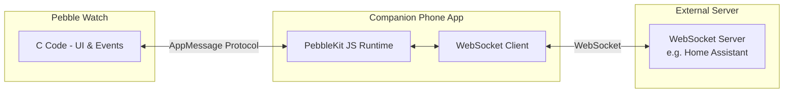
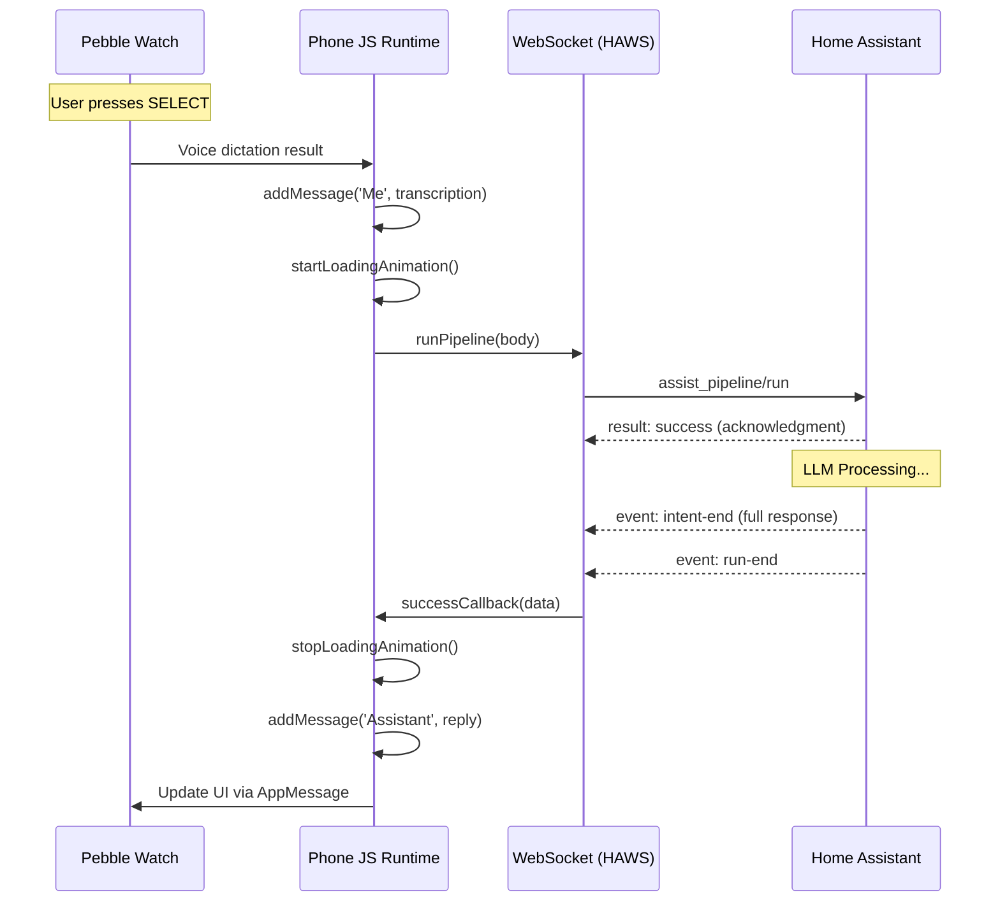

# Building a Pebble App with WebSockets via Android JS Bridge

A comprehensive implementation guide for building Pebble smartwatch applications that communicate with external services via WebSockets running on the companion phone app, without any cloud dependency.

---

## Table of Contents

1. [Architecture Overview](#1-architecture-overview)
2. [Project Structure](#2-project-structure)
3. [Setting Up the Build Environment](#3-setting-up-the-build-environment)
4. [The Pebble.js Framework](#4-the-pebblejs-framework)
5. [WebSocket Implementation](#5-websocket-implementation)
6. [AppMessage Communication Protocol](#6-appmessage-communication-protocol)
7. [Settings and Configuration](#7-settings-and-configuration)
8. [UI Components](#8-ui-components)
9. [Voice Dictation Integration](#9-voice-dictation-integration)
10. [LLM Assistant Response Flow](#10-llm-assistant-response-flow-home-assistant)
11. [Complete Working Example](#11-complete-working-example)

---

## 1. Architecture Overview

### Communication Flow



### Key Concepts

1. **No Cloud Requirement**: The WebSocket connection runs on the companion phone, connecting directly to your server (e.g., on your local network)

2. **AppMessage Bridge**: Pebble uses a proprietary `AppMessage` protocol for watch-phone communication. The JavaScript runtime on the phone has full network access.

3. **Pebble.js Framework**: A high-level JavaScript framework that abstracts the AppMessage protocol, allowing you to write most of your app logic in JS.

4. **Hybrid Architecture**: 
   - **C Code** (on watch): Handles UI rendering, button events, hardware access
   - **JS Code** (on phone): Handles network requests, complex logic, persistent storage

---

## 2. Project Structure

```
my-pebble-app/
├── appinfo.json              # App metadata & resources
├── package.json              # npm dependencies
├── wscript                   # Build configuration
├── Makefile                  # Build shortcuts
├── src/
│   ├── main.c                # C entry point (minimal for Pebble.js)
│   ├── js/
│   │   ├── main.js           # JS entry point
│   │   ├── app.js            # Main application logic
│   │   ├── lib/              # Utility libraries
│   │   │   ├── ajax.js       # HTTP request helper
│   │   │   ├── emitter.js    # Event emitter
│   │   │   └── struct.js     # Binary data structures
│   │   ├── ui/               # UI components
│   │   │   ├── simply-pebble.js   # Core AppMessage bridge
│   │   │   ├── card.js       # Card UI component
│   │   │   ├── menu.js       # Menu UI component
│   │   │   ├── window.js     # Window base class
│   │   │   └── voice.js      # Voice dictation
│   │   ├── settings/         # Settings management
│   │   │   └── settings.js   # Persistent settings
│   │   └── vendor/           # Third-party libraries
│   │       └── haws.js       # WebSocket client
│   └── simply/               # C code for Pebble.js
│       ├── simply.c          # Core initialization
│       ├── simply_msg.c      # AppMessage handling
│       ├── simply_ui.c       # UI rendering
│       └── simply_voice.c    # Voice dictation
├── resources/
│   └── images/               # Image assets
└── config/
    └── v1.0.html             # Configuration page (hosted HTML)
```

---

## 3. Setting Up the Build Environment

### appinfo.json

This is your app's manifest file:

```json
{
  "uuid": "61ae3254-ce00-49db-aad8-23143f649b90",
  "shortName": "My WebSocket App",
  "longName": "My WebSocket App",
  "companyName": "your.domain",
  "versionLabel": "1.0",
  "versionCode": 1,
  "sdkVersion": "3",
  "targetPlatforms": [
    "aplite",      // Original Pebble
    "basalt",      // Pebble Time
    "chalk",       // Pebble Time Round
    "diorite",     // Pebble 2
    "emery"        // Pebble Time 2
  ],
  "watchapp": {
    "watchface": false,
    "hiddenApp": false
  },
  "capabilities": [
    "configurable"   // Enable settings page
  ],
  "resources": {
    "media": [
      {
        "file": "images/appicon.png",
        "menuIcon": true,
        "name": "IMAGE_MENU_ICON",
        "type": "bitmap"
      }
    ]
  },
  "appKeys": {}
}
```

### Build Commands

```bash
# Install dependencies
npm install

# Build the app
pebble build

# Install on connected watch
pebble install --logs --phone <PHONE_IP>
```

---

## 4. The Pebble.js Framework

### Entry Point (main.js)

```javascript
// src/js/main.js
var safe = require('safe');
var util2 = require('util2');

Pebble.addEventListener('ready', function(e) {
  // Initialize the Pebble protocol bridge
  require('ui/simply-pebble.js').init();
  
  // Load your main application
  require('./app');
});
```

### Module Loading System (loader.js)

The Pebble.js framework uses a custom CommonJS-style module loader:

```javascript
// src/js/loader.js
var __loader = (function() {
  var loader = {};
  
  loader.packages = {};
  loader.paths = ['/', 'lib', 'vendor'];
  
  loader.require = function(path, requirer) {
    var module = loader.getPackage(path, requirer);
    if (!module) {
      throw new Error("Cannot find module '" + path + "'");
    }
    
    if (module.exports) {
      return module.exports;
    }
    
    var require = function(path) { 
      return loader.require(path, module); 
    };
    
    module.exports = {};
    module.loader(module.exports, module, require);
    module.loaded = true;
    
    return module.exports;
  };
  
  loader.define = function(path, lineno, loadfun) {
    var module = {
      filename: path,
      lineno: lineno,
      loader: loadfun,
    };
    loader.packages[path] = module;
  };
  
  return loader;
})();
```

---

## 5. WebSocket Implementation

### WebSocket Client Class (haws.js)

This is a complete WebSocket client implementation that handles:
- Connection management with auto-reconnect
- Authentication
- Request/response correlation
- Event subscriptions

```javascript
// src/js/vendor/haws.js

/**
 * WebSocket Client with Request/Response Pattern
 * Provides callback-based async communication
 */
class HAWS {
    constructor(server_url, token, debug, coalesce_messages) {
        this.events = new EventTarget();
        this.connected = false;
        this.reconnectTimeout = null;
        this.selfDisconnect = false;
        this.server_url = server_url;
        this.token = token;
        this.ws = null;
        this._last_cmd_id = 0;
        this._commands = new Map();
        this._subscriptions = [];
        this.reconnectInterval = 2500;
        this.debug = debug || false;
        this.coalesce_messages = coalesce_messages || false;
    }

    isConnected() {
        return this.connected;
    }

    // Connect to WebSocket server
    connect() {
        if(this.connected) {
            return false;
        }

        // Convert HTTP URL to WebSocket URL
        let ws_url = this.server_url
            .replace('http','ws')
            .replace(/\/+$/, '') + '/api/websocket';
            
        this.ws = new WebSocket(ws_url);
        
        // Connection opened
        this.ws.onopen = (evt) => {
            this.connected = true;
            this._log("WebSocket connected");
            this.trigger("open", {detail: evt.detail});
        };
        
        // Connection closed
        this.ws.onclose = (evt) => {
            this.connected = false;
            this.trigger("close", {detail: evt.detail});
            
            if (!this.selfDisconnect) {
                this._log("Connection lost, reconnecting...");
                this._attemptReconnect();
            }
        };
        
        // Message received
        this.ws.onmessage = (evt) => {
            let data = JSON.parse(evt.data);
            
            // Handle message arrays (coalesced messages)
            if(Array.isArray(data)) {
                for(let message of data) {
                    this._handleMessage(message);
                }
            } else {
                this._handleMessage(data);
            }
        };
        
        // Error occurred
        this.ws.onerror = (evt) => {
            this._log("WebSocket error");
            this.ws.close();
            this.trigger("error", {detail: evt.detail});
            this.connected = false;
        };
    }

    // Handle incoming messages
    _handleMessage(data) {
        this._log("Received: " + data.type);

        switch(data.type) {
            // Server requests authentication
            case 'auth_required':
                this.ws.send(JSON.stringify({
                    type: 'auth',
                    access_token: this.token,
                }));
                break;

            // Authentication successful
            case 'auth_ok':
                // Optionally enable message coalescing
                if(this.coalesce_messages) {
                    this._last_cmd_id = 1;
                    this.ws.send(JSON.stringify({
                        id: 1,
                        type: 'supported_features',
                        features: { coalesce_messages: 1 }
                    }));
                }
                this.trigger("auth_ok", {detail: data});
                break;

            // Authentication failed
            case 'auth_invalid':
                this.trigger("auth_invalid", {detail: data});
                this.close();
                break;

            // Event from subscription
            case 'event':
                if(data.id && this._commands.has(data.id)) {
                    let callback = this._commands.get(data.id);
                    if(typeof callback[0] === "function") {
                        callback[0](data);
                    }
                }
                this.trigger("event", {detail: data});
                break;

            // Result from command
            case 'result':
                // Ignore supported_features response
                if(data.id === 1 && this.coalesce_messages) break;

                if(data.id && this._commands.has(data.id)) {
                    let callback = this._commands.get(data.id);
                    
                    if (data.success) {
                        // Success callback (ignore subscription confirmations)
                        if(this._subscriptions.indexOf(data.id) === -1) {
                            if(typeof callback[0] === "function") {
                                callback[0](data);
                            }
                            this._commands.delete(data.id);
                        }
                    } else {
                        // Error callback
                        if(typeof callback[1] !== 'undefined') {
                            callback[1](data);
                        }
                        this._commands.delete(data.id);
                    }
                }
                this.trigger("result", {detail: data});
                break;
        }
    }

    // Send a command with callbacks
    send(msg, successCallback, errorCallback) {
        if(!this.connected) return false;
        
        if(!msg.id) {
            msg.id = this._genCmdId();
        }
        
        this.ws.send(JSON.stringify(msg));
        this._commands.set(msg.id, [successCallback, errorCallback]);
        
        return msg.id;
    }

    // Generate unique command ID
    _genCmdId() {
        if(this._last_cmd_id > 9999) {
            this._last_cmd_id = 0;
        }
        return ++this._last_cmd_id;
    }

    // Subscribe to real-time state changes
    subscribeEntities(entity_ids, successCallback, errorCallback) {
        let data = {
            "type": "subscribe_entities",
            "entity_ids": Array.isArray(entity_ids) 
                ? entity_ids 
                : [entity_ids]
        };

        let msg_id = this.send(data, successCallback, errorCallback);
        this._subscriptions.push(msg_id);
        
        return msg_id;
    }

    // Unsubscribe from events
    unsubscribe(msg_id) {
        let idx = this._subscriptions.indexOf(msg_id);
        if(idx > -1) {
            this._subscriptions.splice(idx, 1);
        }
        
        this._commands.delete(msg_id);
        
        this.send({
            "type": "unsubscribe_events",
            "subscription": msg_id
        });
    }

    // Call a service (e.g., turn on light)
    callService(domain, service, service_data, target, 
                successCallback, errorCallback) {
        let data = {
            "type": "call_service",
            "domain": domain,
            "service": service
        };

        if(service_data) data['service_data'] = service_data;
        if(target) data['target'] = target;

        return this.send(data, successCallback, errorCallback);
    }

    // Disconnect gracefully
    disconnect() {
        this.selfDisconnect = true;
        if (this.reconnectTimeout) {
            clearTimeout(this.reconnectTimeout);
            this.reconnectTimeout = null;
        }
        this.ws.close();
    }

    // Auto-reconnect logic
    _attemptReconnect() {
        this.reconnectTimeout = setTimeout(() => {
            this._log("Attempting reconnection...");
            this.connect();
        }, this.reconnectInterval);
    }

    // Event listener registration
    on(event, callback) {
        return this.events.addEventListener(event, callback);
    }

    trigger(event, data) {
        return this.events.dispatchEvent(
            new CustomEvent(event, data)
        );
    }

    _log(msg) {
        if(this.debug) console.log(`[WS] ${msg}`);
    }
}

module.exports = HAWS;
```

### Using the WebSocket Client

```javascript
// src/js/app.js
const HAWS = require('vendor/haws');
const UI = require('ui');
const Settings = require('settings');

// Load configuration
const server_url = Settings.option('server_url');
const auth_token = Settings.option('auth_token');

// Initialize WebSocket client
let ws = new HAWS(server_url, auth_token, true);

// Create loading card
let loadingCard = new UI.Card({
    title: 'My App',
    subtitle: 'Connecting...'
});
loadingCard.show();

// Handle connection events
ws.on('open', function(evt) {
    loadingCard.subtitle('Authenticating...');
});

ws.on('auth_ok', function(evt) {
    loadingCard.subtitle('Connected!');
    
    // Now you can make requests
    fetchData();
});

ws.on('auth_invalid', function(evt) {
    loadingCard.subtitle('Auth Failed');
    loadingCard.body('Check your token');
});

ws.on('close', function(evt) {
    loadingCard.subtitle('Reconnecting...');
    loadingCard.show();
});

// Connect
ws.connect();

function fetchData() {
    // Fetch states from server
    ws.send(
        { type: 'get_states' },
        function(response) {
            // Success
            console.log('Got states:', response.result.length);
            showMainMenu(response.result);
        },
        function(error) {
            // Error
            console.log('Error:', error);
        }
    );
}
```

---

## 6. AppMessage Communication Protocol

### How Pebble.js Bridges Watch and Phone

The `simply-pebble.js` file implements the bridge between JavaScript and C code using binary packets:

```javascript
// src/js/ui/simply-pebble.js

/**
 * Packet Structure Definition
 * Uses the struct library to define binary packet formats
 */
var struct = require('struct');

// Base packet header (all packets start with this)
var Packet = new struct([
  ['uint16', 'type'],    // Command type identifier
  ['uint16', 'length'],  // Total packet length
]);

// Packet for displaying a card
var CardTextPacket = new struct([
  [Packet, 'packet'],           // Include base header
  ['uint8', 'index'],           // Which text field (title/subtitle/body)
  ['uint8', 'color'],           // Text color
  ['cstring', 'text'],          // The actual text content
]);

// Packet for menu items
var MenuItemPacket = new struct([
  [Packet, 'packet'],
  ['uint16', 'section'],
  ['uint16', 'item'],
  ['uint32', 'icon'],
  ['uint16', 'titleLength'],
  ['uint16', 'subtitleLength'],
  ['cstring', 'title'],
  ['cstring', 'subtitle'],
]);

/**
 * MessageQueue - Ensures reliable ordered delivery
 */
var MessageQueue = function() {
  this._queue = [];
  this._sending = false;
};

MessageQueue.prototype.send = function(message) {
  this._queue.push(message);
  if (!this._sending) {
    this._sending = true;
    this.cycle();
  }
};

MessageQueue.prototype.cycle = function() {
  if (this._queue.length === 0) {
    this._sending = false;
    return;
  }
  
  var head = this._queue[0];
  var self = this;
  
  Pebble.sendAppMessage(
    head,
    function() { // Success
      self._queue.shift();
      self.cycle();
    },
    function() { // Failure - retry
      self.cycle();
    }
  );
};

/**
 * PacketQueue - Combines multiple packets into single messages
 * Reduces latency by batching
 */
var PacketQueue = function() {
  this._message = [];
};

PacketQueue.prototype._maxPayloadSize = 2044 - 32; // Max AppMessage size

PacketQueue.prototype.add = function(packet) {
  var byteArray = toByteArray(packet);
  
  // If adding would exceed max size, send current batch
  if (this._message.length + byteArray.length > this._maxPayloadSize) {
    this.send();
  }
  
  // Add packet bytes to current batch
  Array.prototype.push.apply(this._message, byteArray);
  
  // Schedule send after current JS execution completes
  clearTimeout(this._timeout);
  this._timeout = setTimeout(this.send.bind(this), 0);
};

PacketQueue.prototype.send = function() {
  if (this._message.length === 0) return;
  
  // Send as key 0 in the AppMessage dictionary
  messageQueue.send({ 0: this._message });
  this._message = [];
};

/**
 * SimplyPebble - The main bridge object
 */
var SimplyPebble = {};

SimplyPebble.init = function() {
  // Listen for messages from the watch
  Pebble.addEventListener('appmessage', SimplyPebble.onAppMessage);
  
  // Initialize queues
  state.messageQueue = new MessageQueue();
  state.packetQueue = new PacketQueue();
  
  // Signal readiness
  SimplyPebble.ready();
};

// Handle incoming messages from watch
SimplyPebble.onAppMessage = function(e) {
  var dict = e.payload;
  
  // Payload key 0 contains the packet bytes
  var bytes = dict[0];
  if (!bytes) return;
  
  // Parse and handle packets
  while (bytes.length > 0) {
    var packet = parsePacket(bytes);
    handlePacket(packet);
    bytes = bytes.slice(packet.length);
  }
};

// Send a card text update
SimplyPebble.cardText = function(field, text, color) {
  CardTextPacket
    .index(field)
    .color(color || 'clearWhite')
    .text(text || '');
  
  state.packetQueue.add(CardTextPacket);
};

module.exports = SimplyPebble;
```

### C-Side Message Handling

```c
// src/simply/simply_msg.c

#include "simply_msg.h"
#include <pebble.h>

// Inbound/outbound buffer sizes
static const size_t APP_MSG_SIZE_INBOUND = 2044;
static const size_t APP_MSG_SIZE_OUTBOUND = 1024;

// Callback when message received from phone
static void received_callback(DictionaryIterator *iter, void *context) {
  Tuple *tuple = dict_find(iter, 0); // Key 0 contains data
  if (!tuple) return;
  
  uint8_t *buffer = tuple->value->data;
  size_t length = tuple->length;
  
  // Process all packets in the message
  while (length > 0) {
    Packet *packet = (Packet*) buffer;
    
    // Dispatch to appropriate handler
    handle_packet(context, packet);
    
    // Move to next packet
    length -= packet->length;
    buffer += packet->length;
  }
}

// Initialize AppMessage system
SimplyMsg *simply_msg_create(Simply *simply) {
  SimplyMsg *self = malloc(sizeof(*self));
  
  // Open AppMessage with specified buffer sizes
  app_message_open(APP_MSG_SIZE_INBOUND, APP_MSG_SIZE_OUTBOUND);
  
  // Set context for callbacks
  app_message_set_context(simply);
  
  // Register callbacks
  app_message_register_inbox_received(received_callback);
  app_message_register_inbox_dropped(dropped_callback);
  app_message_register_outbox_sent(sent_callback);
  app_message_register_outbox_failed(failed_callback);
  
  return self;
}

// Send a packet to the phone
bool simply_msg_send_packet(Packet *packet) {
  Packet *copy = malloc(packet->length);
  memcpy(copy, packet, packet->length);
  
  DictionaryIterator *iter;
  app_message_outbox_begin(&iter);
  dict_write_data(iter, 0, (uint8_t*)copy, packet->length);
  
  return app_message_outbox_send() == APP_MSG_OK;
}
```

---

## 7. Settings and Configuration

### Settings Manager (settings.js)

```javascript
// src/js/settings/settings.js

var appinfo = require('appinfo');

var Settings = module.exports;

var state = {
  options: {},
  data: {},
  listeners: []
};

// Initialize settings system
Settings.init = function() {
  Settings._loadOptions();
  Settings._loadData();
  
  // Register configuration event listeners
  Pebble.addEventListener('showConfiguration', Settings.onOpenConfig);
  Pebble.addEventListener('webviewclosed', Settings.onCloseConfig);
};

// Generate storage key
Settings._getDataKey = function(path, field) {
  path = path || appinfo.uuid;
  return field + ':' + path;
};

// Save data to localStorage
Settings._saveData = function(path, field, data) {
  field = field || 'data';
  if (data) state[field] = data;
  else data = state[field];
  
  var key = Settings._getDataKey(path, field);
  localStorage.setItem(key, JSON.stringify(data));
};

// Load data from localStorage
Settings._loadData = function(path, field) {
  field = field || 'data';
  var key = Settings._getDataKey(path, field);
  var value = localStorage.getItem(key);
  
  try {
    var data = JSON.parse(value);
    if (typeof data === 'object' && data !== null) {
      state[field] = data;
    }
    return data;
  } catch (e) {
    return undefined;
  }
};

// Get/set a single option
Settings.option = function(field, value) {
  var data = state.options;
  
  if (arguments.length === 0) {
    return data; // Return all options
  }
  
  if (arguments.length === 1) {
    return data[field]; // Get single option
  }
  
  // Set single option
  if (value === undefined || value === null) {
    delete data[field];
  } else {
    data[field] = value;
  }
  
  Settings._saveOptions();
};

// Configure the settings page
Settings.config = function(options, openCallback, closeCallback) {
  if (typeof options === 'string') {
    options = { url: options };
  }
  
  state.listeners.push({
    params: options,
    open: openCallback,
    close: closeCallback,
  });
};

// Called when user opens settings in Pebble app
Settings.onOpenConfig = function(e) {
  var listener = state.listeners[state.listeners.length - 1];
  if (!listener) return;
  
  // Build URL with current settings as hash
  var url = listener.params.url;
  url += '#' + encodeURIComponent(JSON.stringify(state.options));
  
  // Open the settings page
  Pebble.openURL(url);
};

// Called when settings page is closed
Settings.onCloseConfig = function(e) {
  if (e.response === 'CANCELLED') return;
  
  var listener = state.listeners[state.listeners.length - 1];
  
  // Parse returned options
  var options = {};
  if (e.response) {
    try {
      options = JSON.parse(decodeURIComponent(e.response));
    } catch (ex) { }
  }
  
  // Merge new options
  Object.assign(state.options, options);
  Settings._saveOptions();
  
  // Call the close callback
  if (listener && listener.close) {
    listener.close({
      originalOptions: { ...state.options },
      options: options,
      response: e.response
    });
  }
};
```

### Configuration Page (HTML)

The settings page is a hosted HTML file that the Pebble app opens as a web view:

```html
<!-- config/settings.html (host this on your server) -->
<!DOCTYPE html>
<html>
<head>
  <title>App Settings</title>
  <meta name="viewport" content="width=device-width">
  <style>
    body { font-family: sans-serif; padding: 20px; }
    .form-group { margin-bottom: 15px; }
    label { display: block; margin-bottom: 5px; }
    input, select { width: 100%; padding: 10px; box-sizing: border-box; }
    button { width: 100%; padding: 15px; background: #ff4700; 
             color: white; border: none; font-size: 16px; }
  </style>
</head>
<body>
  <h1>Settings</h1>
  
  <div class="form-group">
    <label for="server_url">Server URL</label>
    <input type="url" id="server_url" placeholder="https://example.com">
  </div>
  
  <div class="form-group">
    <label for="auth_token">Authentication Token</label>
    <input type="password" id="auth_token">
  </div>
  
  <div class="form-group">
    <label>
      <input type="checkbox" id="enable_feature"> Enable Feature
    </label>
  </div>
  
  <button id="save">Save Settings</button>
  
  <script>
    // Parse existing settings from URL hash
    function getOptions() {
      try {
        return JSON.parse(decodeURIComponent(location.hash.slice(1)));
      } catch (e) {
        return {};
      }
    }
    
    // Load existing settings into form
    var options = getOptions();
    if (options.server_url) {
      document.getElementById('server_url').value = options.server_url;
    }
    if (options.auth_token) {
      document.getElementById('auth_token').value = options.auth_token;
    }
    if (options.enable_feature) {
      document.getElementById('enable_feature').checked = true;
    }
    
    // Save and close
    document.getElementById('save').addEventListener('click', function() {
      var newOptions = {
        server_url: document.getElementById('server_url').value,
        auth_token: document.getElementById('auth_token').value,
        enable_feature: document.getElementById('enable_feature').checked
      };
      
      // Return settings to Pebble app
      location.href = 'pebblejs://close#' + 
        encodeURIComponent(JSON.stringify(newOptions));
    });
  </script>
</body>
</html>
```

### Using Settings in Your App

```javascript
// src/js/app.js
const Settings = require('settings');
const UI = require('ui');
const HAWS = require('vendor/haws');

// Configure settings URL
Settings.config({
    url: 'https://your-server.com/pebble-config.html',
  },
  function(e) {
    console.log('Settings opened');
  },
  function(e) {
    console.log('Settings closed with:', e.options);
    
    // Reload configuration
    loadSettings();
    
    // Reconnect with new settings
    reconnect();
  }
);

function loadSettings() {
  var url = Settings.option('server_url');
  var token = Settings.option('auth_token');
  var feature = Settings.option('enable_feature');
  
  // Use settings...
}
```

---

## 8. UI Components

### Card Component

```javascript
// Basic card display
const UI = require('ui');

let card = new UI.Card({
  title: 'My Title',
  subtitle: 'Subtitle here',
  body: 'This is the body text that can be quite long...',
  scrollable: true,  // Enable scrolling for long content
  status: {
    color: 'white',
    backgroundColor: 'blue'
  }
});

// Update card content
card.title('New Title');
card.body('Updated body content');

// Handle button presses
card.on('click', 'select', function(e) {
  console.log('Select button pressed');
});

card.on('click', 'back', function(e) {
  card.hide();
});

card.on('longClick', 'select', function(e) {
  console.log('Long press on select');
});

// Show the card
card.show();
```

### Menu Component

```javascript
const UI = require('ui');
const Vibe = require('ui/vibe');

let menu = new UI.Menu({
  backgroundColor: 'black',
  textColor: 'white',
  highlightBackgroundColor: 'white',
  highlightTextColor: 'black',
  sections: [{
    title: 'Section Header',
    items: [
      { title: 'Item 1', subtitle: 'Description' },
      { title: 'Item 2', subtitle: 'Another one' }
    ]
  }]
});

// Dynamically update items
menu.on('show', function() {
  menu.items(0, [
    { title: 'Dynamic Item 1', data: { id: 1 } },
    { title: 'Dynamic Item 2', data: { id: 2 } }
  ]);
});

// Handle selection
menu.on('select', function(e) {
  console.log('Selected:', e.item.title);
  console.log('Custom data:', e.item.data);
  
  // Perform action based on selection
  performAction(e.item.data.id);
});

// Handle long press
menu.on('longSelect', function(e) {
  Vibe.vibrate('short');
  console.log('Long press on:', e.item.title);
});

menu.show();
```

### Window Component (Custom UI)

```javascript
const UI = require('ui');
const Vector = require('vector2');
const Feature = require('platform/feature');

let window = new UI.Window({
  backgroundColor: 'white',
  scrollable: true
});

// Add text elements
let title = new UI.Text({
  position: new Vector(0, 0),
  size: new Vector(Feature.resolution().x, 30),
  text: 'Custom Window',
  font: 'gothic-24-bold',
  color: 'black',
  textAlign: 'center'
});

window.add(title);

// Add rectangles
let rect = new UI.Rect({
  position: new Vector(10, 40),
  size: new Vector(100, 20),
  backgroundColor: 'blue'
});

window.add(rect);

// Add circles
let circle = new UI.Circle({
  position: new Vector(70, 100),
  radius: 15,
  backgroundColor: 'red'
});

window.add(circle);

// Handle buttons
window.on('click', 'up', function() {
  console.log('Up pressed');
});

window.on('click', 'down', function() {
  console.log('Down pressed');
});

window.on('click', 'select', function() {
  console.log('Select pressed');
});

window.show();
```

---

## 9. Voice Dictation Integration

### Voice Module (JavaScript)

```javascript
// src/js/ui/voice.js
var simply = require('ui/simply');

var Voice = {};

Voice.dictate = function(type, confirm, callback) {
  type = type.toLowerCase();
  
  switch (type) {
    case 'stop':
      simply.impl.voiceDictationStop();
      break;
      
    case 'start':
      if (typeof callback === 'undefined') {
        callback = confirm;
        confirm = true;
      }
      simply.impl.voiceDictationStart(callback, confirm);
      break;
      
    default:
      console.log('Unsupported type: ' + type);
  }
};

module.exports = Voice;
```

### Voice Dictation in simply-pebble.js

```javascript
// Handle starting voice dictation
SimplyPebble.voiceDictationStart = function(callback, enableConfirmation) {
  // Check for microphone support (aplite doesn't have one)
  if (Platform.version() === 'aplite') {
    callback({
      'err': 'noMicrophone',
      'failed': true,
      'transcription': null,
    });
    return;
  }
  
  // Check if dictation already in progress
  if (state.dictationCallback) {
    callback({
      'err': 'sessionAlreadyInProgress',
      'failed': true,
      'transcription': null,
    });
    return;
  }

  // Store callback and send start packet
  state.dictationCallback = callback;
  
  VoiceDictationStartPacket.enableConfirmation(enableConfirmation);
  SimplyPebble.sendPacket(VoiceDictationStartPacket);
};

// Handle incoming voice data from watch
SimplyPebble.onVoiceData = function(packet) {
  if (!state.dictationCallback) {
    console.log("No callback for dictation");
    return;
  }
  
  var e = {
    'err': DictationSessionStatus[packet.status()],
    'failed': packet.status() !== 0,
    'transcription': packet.transcription(),
  };
  
  // Invoke and clear callback
  state.dictationCallback(e);
  delete state.dictationCallback;
};
```

### Voice Dictation in C

```c
// src/simply/simply_voice.c

#include "simply_voice.h"
#include <pebble.h>

#define SIMPLY_VOICE_BUFFER_LENGTH 512

static SimplyVoice *s_voice;

// Dictation session callback
static void dictation_session_callback(
    DictationSession *session, 
    DictationSessionStatus status,
    char *transcription, 
    void *context) {
  
  s_voice->in_progress = false;
  
  // Send result back to JavaScript
  send_voice_data(status, transcription);
}

// Start dictation when requested by JS
static void handle_voice_start_packet(Simply *simply, Packet *data) {
  // Check if already in progress
  if (s_voice->in_progress) {
    send_voice_data(64, ""); // 64 = SessionAlreadyInProgress
    return;
  }
  
  s_voice->in_progress = true;
  
  VoiceStartPacket *packet = (VoiceStartPacket*) data;
  
  // Configure confirmation dialog
  dictation_session_enable_confirmation(
    s_voice->session, 
    packet->enable_confirmation
  );
  
  // Start dictation with slight delay for UI responsiveness
  s_voice->timer = app_timer_register(0, 
    timer_callback_start_dictation, NULL);
}

// Create voice system
SimplyVoice *simply_voice_create(Simply *simply) {
  SimplyVoice *self = malloc(sizeof(*self));
  
  *self = (SimplyVoice) {
    .simply = simply,
    .in_progress = false,
  };
  
  // Create dictation session
  self->session = dictation_session_create(
    SIMPLY_VOICE_BUFFER_LENGTH, 
    dictation_session_callback, 
    NULL
  );
  
  s_voice = self;
  return self;
}
```

### Using Voice Dictation with WebSocket

```javascript
// Complete voice assistant example
const Voice = require('ui/voice');
const UI = require('ui');
const HAWS = require('vendor/haws');

function startVoiceAssistant(ws) {
  let card = new UI.Card({
    title: 'Assistant',
    body: 'Listening...',
    scrollable: true
  });
  
  card.show();
  
  Voice.dictate('start', true, function(e) {
    if (e.err) {
      if (e.err === 'systemAborted') {
        // User cancelled
        card.hide();
        return;
      }
      
      card.body('Error: ' + e.err);
      return;
    }
    
    // Got transcription
    card.body('You: ' + e.transcription + '\n\nProcessing...');
    
    // Send to server via WebSocket
    ws.send({
      type: 'assist_pipeline/run',
      start_stage: 'intent',
      end_stage: 'intent',
      input: { text: e.transcription },
      timeout: 30
    }, 
    function(response) {
      // Success
      let reply = response.response.speech.plain.speech;
      card.body('You: ' + e.transcription + '\n\nAssistant: ' + reply);
    },
    function(error) {
      // Error
      card.body('Error: ' + (error.error || 'Connection failed'));
    });
  });
  
  // Allow starting new dictation
  card.on('click', 'select', function() {
    Voice.dictate('start', true, function(e) {
      // Handle next dictation...
    });
  });
}
```

---

## 10. LLM Assistant Response Flow (Home Assistant)

This section documents how the app sends voice commands to Home Assistant's conversation agent (LLM) and displays the responses. 

> [!IMPORTANT]
> The LLM response arrives as a **complete message**, not streamed tokens. Home Assistant's assist pipeline uses event-based communication where the full response is delivered in a single `intent-end` event.

### Sequence Diagram



### Starting the Voice Flow

From [app.js](file:///c:/Users/Shinko/Desktop/pebble-home-assistant-ws/src/js/app.js#L1879-L1992):

```javascript
function startAssist() {
    // Start voice dictation on the watch
    Voice.dictate('start', voice_confirm, function(e) {
        if (e.err) {
            if (e.err === "systemAborted") {
                // User cancelled dictation
                if(!conversationElements.length) {
                    assistWindow.hide();
                }
                return;
            }
            showError('Transcription error - ' + e.err);
            return;
        }

        // Display user's message immediately
        addMessage('Me', e.transcription, function() {
            // Start loading animation (dots)
            let animationTimer = startLoadingAnimation();

            // Build the pipeline request
            const body = {
                start_stage: "intent",   // Skip STT (we have text)
                end_stage: "intent",     // Skip TTS (we display text)
                input: {
                    text: e.transcription
                },
                pipeline: selected_pipeline,
                conversation_id: conversation_id,  // For multi-turn
                timeout: 30
            };

            // Send via WebSocket
            haws.runPipeline(body,
                function(data) {
                    // Success callback
                    stopLoadingAnimation(animationTimer);

                    // Extract the response text
                    const reply = data.response.speech.plain.speech;
                    const conversationId = data.conversation_id;

                    // Display assistant's response
                    addMessage('Assistant', reply, null);
                    
                    // Store conversation ID for context
                    if (conversationId) {
                        conversation_id = conversationId;
                    }
                },
                function(error) {
                    // Error callback
                    stopLoadingAnimation(animationTimer);
                    showError(error.error || 'Connection error');
                }
            );
        });
    });
}
```

### The runPipeline Method (WebSocket Event Subscription)

From [haws.js](file:///c:/Users/Shinko/Desktop/pebble-home-assistant-ws/src/js/vendor/haws.js#L509-L578):

```javascript
runPipeline(data, successCallback, errorCallback) {
    const msg = {
        type: 'assist_pipeline/run',
        ...data
    };

    msg.id = this._genCmdId();

    // This is a SUBSCRIPTION - we'll receive multiple events
    const subscriptionId = msg.id;
    this._subscriptions.push(subscriptionId);

    // Handler processes all incoming events for this subscription
    const handler = (response) => {
        if (response.type === 'result') {
            if (!response.success) {
                errorCallback(response.error || 'Failed to start pipeline');
                this.unsubscribe(subscriptionId);
            }
            return; // Just acknowledgment, wait for actual events
        }

        if (response.type === 'event') {
            const event = response.event;

            // Pipeline finished
            if (event.type === 'run-end') {
                this.unsubscribe(subscriptionId);
                return;
            }

            // Error occurred
            if (event.type === 'error') {
                errorCallback({
                    error: event.data?.message || 'Pipeline error',
                    code: event.data?.code || 'unknown'
                });
                this.unsubscribe(subscriptionId);
                return;
            }

            // LLM response is ready (COMPLETE, not streamed)
            if (event.type === 'intent-end' && event.data?.intent_output) {
                successCallback({
                    success: true,
                    response: event.data.intent_output.response,
                    conversation_id: event.data.intent_output.conversation_id
                });
            }
        }
    };

    this._commands.set(subscriptionId, [handler, errorCallback]);
    this.ws.send(JSON.stringify(msg));
    return subscriptionId;
}
```

### Response Structure

The `intent-end` event contains the complete LLM response:

```javascript
// event.data.intent_output structure:
{
    "response": {
        "speech": {
            "plain": {
                "speech": "I've turned on the living room light.",
                "extra_data": null
            }
        },
        "card": {},
        "language": "en",
        "response_type": "action_done",
        "data": { /* action details */ }
    },
    "conversation_id": "01H5X..."  // For multi-turn context
}

// Extracting the text:
const reply = data.response.speech.plain.speech;
```

### Why Not Token Streaming?

1. **Home Assistant doesn't stream tokens** - The assist_pipeline API sends stage events (`stt-end`, `intent-end`, `tts-end`), not incremental tokens

2. **AppMessage latency** - Each watch↔phone message has ~100ms round-trip, making per-token updates impractical

3. **Pebble screen constraints** - The small display and slow refresh would make streaming visually jarring

4. **The response is typically short** - Voice assistant responses are usually 1-2 sentences

### Loading Animation

While waiting for the LLM response, the app displays animated loading dots:

```javascript
function startLoadingAnimation() {
    // Three dots that appear/disappear in sequence
    let animationState = 0;
    
    return setInterval(function() {
        // Cycle through 5 states:
        // 0: [●○○] 1: [●●○] 2: [●●●] 3: [○●●] 4: [○○●]
        for (let i = 0; i < loadingDots.length; i++) {
            assistWindow.remove(loadingDots[i]);
        }
        
        // Add dots based on current state
        switch (animationState) {
            case 0: assistWindow.add(loadingDots[0]); break;
            case 1: 
                assistWindow.add(loadingDots[0]);
                assistWindow.add(loadingDots[1]); 
                break;
            // ... etc
        }
        
        animationState = (animationState + 1) % 5;
    }, 300);
}

function stopLoadingAnimation(animationTimer) {
    clearInterval(animationTimer);
    for (let i = 0; i < loadingDots.length; i++) {
        assistWindow.remove(loadingDots[i]);
    }
}
```

### Displaying Messages with Dynamic Height

The `addMessage()` function calculates text height dynamically for proper scrolling:

```javascript
function addMessage(speaker, message, callback) {
    // Create speaker label
    let speakerLabel = new UI.Text({
        position: new Vector(leftMargin, currentY),
        size: new Vector(textWidth, SPEAKER_HEIGHT),
        text: speaker + ':',
        font: SPEAKER_FONT,
        color: Feature.color('black', 'white')
    });
    assistWindow.add(speakerLabel);

    // Create message text (initially oversized)
    let messageText = new UI.Text({
        position: new Vector(leftMargin, currentY + SPEAKER_HEIGHT),
        size: new Vector(textWidth, 2000),  // Large initial height
        text: message,
        font: MESSAGE_FONT
    });

    // Calculate actual text height
    messageText.getHeight(function(height) {
        // Resize to actual height
        messageText.size(new Vector(textWidth, height + 10));
        assistWindow.add(messageText);

        // Update scroll position
        currentY += SPEAKER_HEIGHT + height + MESSAGE_PADDING;
        
        // Scroll to show new message
        scrollWindowTo(assistWindow, scrollTarget, true);
        
        if (callback) callback();
    });
}
```

---

## 11. Complete Working Example

Here's a minimal but complete example that demonstrates all the concepts:

### app.js

```javascript
/**
 * Complete Pebble WebSocket App Example
 */

const UI = require('ui');
const Voice = require('ui/voice');
const Settings = require('settings');
const Vibe = require('ui/vibe');
const Feature = require('platform/feature');

// Import WebSocket client
const WebSocketClient = require('vendor/websocket-client');

// Configuration
const CONFIG_URL = 'https://your-server.com/pebble-config.html';

// Application state
let wsClient = null;
let isConnected = false;

// Initialize settings
Settings.config({
    url: CONFIG_URL
  },
  function(e) {
    console.log('Config opened');
  },
  function(e) {
    console.log('Config closed');
    // Reconnect with new settings
    reconnect();
  }
);

// Loading screen
let loadingCard = new UI.Card({
  title: 'My App',
  subtitle: 'Starting...',
  status: false
});
loadingCard.show();

// Main function
function main() {
  let serverUrl = Settings.option('server_url');
  let authToken = Settings.option('auth_token');
  
  if (!serverUrl || !authToken) {
    loadingCard.subtitle('Setup Required');
    loadingCard.body('Open settings in the Pebble app');
    return;
  }
  
  // Initialize WebSocket client
  wsClient = new WebSocketClient(serverUrl, authToken, true);
  
  wsClient.on('open', function() {
    loadingCard.subtitle('Authenticating...');
  });
  
  wsClient.on('auth_ok', function() {
    loadingCard.subtitle('Connected!');
    isConnected = true;
    
    // Fetch initial data and show main menu
    fetchInitialData();
  });
  
  wsClient.on('auth_invalid', function() {
    loadingCard.title('Auth Failed');
    loadingCard.subtitle('Invalid token');
  });
  
  wsClient.on('close', function() {
    isConnected = false;
    loadingCard.subtitle('Reconnecting...');
    loadingCard.show();
  });
  
  loadingCard.subtitle('Connecting...');
  wsClient.connect();
}

function reconnect() {
  if (wsClient) {
    wsClient.disconnect();
  }
  main();
}

function fetchInitialData() {
  wsClient.send({ type: 'get_states' }, 
    function(response) {
      showMainMenu(response.result);
    },
    function(error) {
      loadingCard.body('Error loading data');
    }
  );
}

function showMainMenu(items) {
  let menu = new UI.Menu({
    backgroundColor: 'black',
    textColor: 'white',
    highlightBackgroundColor: 'white',
    highlightTextColor: 'black',
    sections: [{
      title: 'My App'
    }]
  });
  
  menu.on('show', function() {
    // Build menu items
    let menuItems = [];
    
    // Add voice option if supported
    if (Feature.microphone(true, false)) {
      menuItems.push({
        title: 'Voice Control',
        subtitle: 'Tap to speak'
      });
    }
    
    // Add items from server
    items.slice(0, 10).forEach(function(item) {
      menuItems.push({
        title: item.name || item.id,
        subtitle: item.state || '',
        data: item
      });
    });
    
    menu.items(0, menuItems);
  });
  
  menu.on('select', function(e) {
    if (e.item.title === 'Voice Control') {
      startVoiceControl();
      return;
    }
    
    // Handle item selection
    showItemDetails(e.item.data);
  });
  
  menu.on('longSelect', function(e) {
    if (e.item.data) {
      toggleItem(e.item.data);
    }
  });
  
  menu.show();
}

function startVoiceControl() {
  let card = new UI.Card({
    title: 'Voice Control',
    body: 'Listening...',
    scrollable: true
  });
  card.show();
  
  Voice.dictate('start', true, function(e) {
    if (e.err) {
      if (e.err === 'systemAborted') {
        card.hide();
        return;
      }
      card.body('Error: ' + e.err);
      return;
    }
    
    card.body('Processing: ' + e.transcription);
    
    // Send to server
    wsClient.send({
      type: 'process_voice',
      text: e.transcription
    },
    function(response) {
      card.body('You: ' + e.transcription + 
                '\n\nResult: ' + response.result);
    },
    function(error) {
      card.body('Error: ' + error.message);
    });
  });
  
  card.on('click', 'select', function() {
    startVoiceControl();
  });
}

function showItemDetails(item) {
  let card = new UI.Card({
    title: item.name || item.id,
    subtitle: 'State: ' + item.state,
    body: JSON.stringify(item.attributes, null, 2),
    scrollable: true
  });
  
  card.on('click', 'select', function() {
    toggleItem(item);
  });
  
  card.show();
}

function toggleItem(item) {
  Vibe.vibrate('short');
  
  wsClient.send({
    type: 'call_service',
    domain: 'homeassistant',
    service: 'toggle',
    target: { entity_id: item.entity_id }
  },
  function(response) {
    console.log('Toggled successfully');
  },
  function(error) {
    console.log('Toggle failed:', error);
    Vibe.vibrate('double');
  });
}

// Start the app
main();
```

---

## Summary

This guide covered the complete architecture for building Pebble apps that communicate via WebSockets through the companion phone app:

1. **Architecture**: The phone acts as a bridge between the watch and external servers
2. **WebSocket Client**: A complete implementation with authentication and subscriptions  
3. **AppMessage Protocol**: How binary packets flow between C and JavaScript
4. **Settings System**: Persistent storage and configuration pages
5. **UI Components**: Cards, menus, and custom windows
6. **Voice Dictation**: Complete speech-to-text integration

The key insight is that **all network operations run on the phone**, while the watch handles UI and user input. The AppMessage protocol bridges these two environments seamlessly, allowing you to write most of your logic in JavaScript while maintaining native UI performance.
